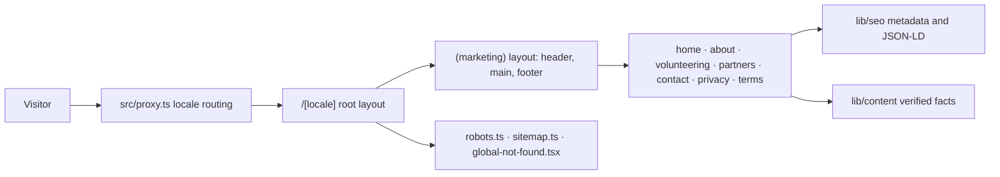

# Web Architecture

## Implemented

A single Next.js 16 App Router application: React 19, strict TypeScript,
Tailwind CSS 4, and `next-intl`. Every marketing page is a Server Component and
is statically generated at build time. There is no API route, database client,
authentication provider, or backend transport.



## Module ownership

| Location | Responsibility |
| --- | --- |
| `src/proxy.ts` | Sends a prefix-less URL to a locale using `Accept-Language`; the only non-static code path |
| `src/app/[locale]/layout.tsx` | Root document, `lang`, typeface, and the client message subset |
| `src/app/[locale]/(marketing)/layout.tsx` | Skip link, header, main landmark, footer |
| `src/app/[locale]/(marketing)/*/page.tsx` | The seven public pages |
| `src/app/robots.ts`, `src/app/sitemap.ts` | Crawl policy and the localized sitemap |
| `src/app/global-not-found.tsx` | 404 for unmatched URLs; required because the root layout sits under a dynamic segment |
| `src/app/globals.css` | Tailwind import, design tokens, base layer, container utility |
| `src/i18n/` | Locale definition, navigation helpers, request config, message catalogs |
| `src/lib/routing/routes.ts` | The single registry of public routes |
| `src/lib/seo/` | Origin helpers, the metadata builder, JSON-LD builders |
| `src/lib/content/` | Verified organisation facts and call-to-action resolution |
| `src/lib/map/` | Generated region geometry, localised region names, SVG path helpers |
| `src/lib/constants/` | External channel resolution and analytics event names |
| `src/components/{ui,brand,marketing}/` | Action styling, brand marks, page composition |

## Rendering rules

Server Components are the default. Five components opt into the client, and all
of them receive their copy as props so no page-level translation reaches the
browser:

- `LocaleSwitcher` needs the active locale and pathname.
- `MobileNav` needs disclosure state and an Escape handler.
- `HeroMapStage` owns the home page's hero, its scroll runway, and the canvas.
- `RollingWords` cycles the region label while respecting reduced motion.
- `CountUp` animates verified figures when they enter the viewport.

The root layout hands `NextIntlClientProvider` only the `nav` namespace.
Forwarding the whole catalog embedded every page's copy in every document:
95KB of raw HTML on the home page against 79KB, and 16.0KB gzipped against
11.4KB. Check for a regression by grepping a rendered page for a string that
only exists on another page.

Every page calls `setRequestLocale` before reading translations. Without it the
route opts out of static generation.

## The hero map

The home page opens on a scroll-driven relief map of Uzbekistan's fourteen
regions, and it is the only WebGL surface on the site. The hero and the map are
one pinned sequence rather than two sections, and it runs in three acts: the map
starts as a faint backdrop below the headline — cropped by the bottom of the
frame — rises into a near plan view as the hero copy retires, then lifts all
fourteen regions out of the base plate, and only once every region is up does the
board turn sideways into its three-quarter portrait. It is built directly on
`three`; there is no React renderer for it, because the scene is a fixed set of
meshes driven by one number and pinning `@react-three/fiber` would tie this
repository's React version to that package's peer range.

| File | Responsibility |
| --- | --- |
| `scripts/build-region-geometry.mjs` | Regenerates the geometry from Natural Earth; run by hand, not in the build |
| `src/lib/map/region-geometry.ts` | Generated: simplified, projected rings and pin anchors |
| `src/lib/map/regions.ts` | Joins the geometry to Uzbek, Russian and English names |
| `src/lib/map/svg-path.ts` | Rings to SVG path data, shared with the fallback |
| `hero-map-section.tsx` | Server: resolves hero copy, caption and region names |
| `hero-map-flat.tsx` | Server: the plan-view SVG everything falls back to |
| `hero-map-stage.tsx` | Client: the sticky runway, scroll progress, copy layers, labels |
| `timeline.ts` | The three acts as pure functions; imported by the scene and covered by unit tests |
| `scene.ts` | The three.js scene; imported dynamically, so it is its own chunk |

Three properties are load-bearing:

- **The section is never blank.** The plan-view SVG is server-rendered and stays
  visible until the canvas reports itself ready. Screenshot pipelines, print,
  crawlers, and browsers without WebGL all keep a finished picture. This costs
  about 9KB gzipped on the home page document and is the reason for it.
- **three.js is not in the initial bundle.** `scene.ts` is imported inside an
  `IntersectionObserver` callback, so the 81KB gzipped chunk is fetched only
  when the section approaches the viewport, and never on any other page.
- **The animation's limit is the next section.** Progress is measured from the
  section's own box against the sticky panel's height, so it reaches 1 exactly
  as the panel releases.
- **The runway only exists once the scene does.** The section is a normal-height
  block until `HeroMapStage` has a working canvas, so a visitor without
  JavaScript or WebGL gets the hero, the plan-view map and the caption stacked
  in flow rather than two viewports of dead scroll.

Under `prefers-reduced-motion` the section never pins. The scene renders one
frame with the country tipped and every region lifted, and the hero copy and
caption both stay at full opacity in normal flow.

### The three acts

One scroll progress value, measured from the section's own box, drives
everything. The schedule lives in `timeline.ts` as pure functions, so the acts
can be asserted without a canvas; `scene.render()` returns the same three curves
the component needs.

| Progress | Act | What happens |
| --- | --- | --- |
| 0 → 0.22 | `emerge` | The map sits at the bottom of the frame, tipped 58° and cropped by the viewport edge, so roughly its top half shows under the centred hero copy. It rises and flattens to a 9° plan view. Hero copy fades and lifts away as this runs. |
| 0.24 → 0.66 | `reveal` | All fourteen regions lift off the base plate one at a time, west to east, each raising a leader line and its label, while the board tips to 33°. The caption fades in. |
| 0.70 → 1 | `turn` | Only now does the board tip on to 56° and turn 12° into its three-quarter portrait. |

The gap between the acts is the point. Turning the board while regions were still
appearing meant a reader who looked away for a second never saw the east of the
country arrive, so the reveal finishes before the turn begins — an invariant
`timeline.test.ts` asserts directly rather than leaving it to the constants.

Copy layers are absolutely positioned while pinned, so the hero occupying its
full height cannot push the caption out of a fixed-height panel. A layer that
has faded out is marked `inert`, because a control that cannot be seen must not
be reachable by keyboard.

### Reading the board

The relief reads as white province faces on a solid blue board. `readPalette()`
takes the plate top from `--color-primary` and its wall from `--color-primary-deep`,
the tiles from `--color-surface-soft` with `--color-primary-muted` walls, so the
constant inset between tiles shows as a blue seam and the exposed plate under a
lifted tile shows as blue depth. Nothing in the scene is a literal colour.

`MeshLambertMaterial` divides irradiance by π, so light intensities that look
reasonable as fractions of one render the whole map as flat grey. The four
lights are tuned so a tile top lands just past 1 — white stays white and the
walls stay a readable step below it — which is why the numbers are around 1–3
rather than around 1. The hemisphere light is positioned toward `+z` rather than
world up, because the map lies in XY and a world-up hemisphere puts its ground
colour on every tile face.

### Showing the regions

Regions are not marked with pins stuck into a flat map. The map is built as a
base plate with the fourteen regions as separate tiles sitting on it, each
inset from its neighbours by a constant *distance* — the inset is computed per
region from its own radius, so a hairline gap reads the same on Karakalpakstan
and on Tashkent city. As progress runs, the tiles lift off the plate and the
gap under them opens, which is what makes the country legible as fourteen
pieces from a raked angle. A thin leader line and a small marker carry each
label up from the tile it belongs to.

Every tile lifts to the same height and every marker is identical. Encoding
region area or anything else in that height would read as a claim about
activity that nothing in `src/lib/content/org.ts` supports.

### How the scene is put together

The country lies in XY with `+x` east and `+y` north, and every region is
extruded along `+z`. The camera stays on the `+z` axis and never orbits; the map
tips because one group rotates about its own x axis. That is both what the design
asks for — the map turns sideways — and the only formulation with no gimbal
degeneracy at plan view, where an orbiting camera's up vector goes parallel to
its view direction.

Framing is recomputed every frame from the rotated silhouette rather than from
fixed camera positions. The tip and the turn both change what the map occupies,
so a fixed distance either crops the Fergana valley off the right edge at full
tip or wastes most of the frame at plan view. Two details matter:

- the fit is solved against the **convex hull** of the country outline, not its
  bounding box, because the box has corners the country never reaches — at a
  phone's aspect ratio that cost about a third of the usable width;
- each point's own depth sets its distance requirement, because the points that
  stick out sideways are not the ones nearest the camera once the map is tipped.

Every pin is identical. Region area is deliberately not encoded in pin height or
size: a taller pin would read as a claim about activity in that region, and
nothing in `src/lib/content/org.ts` supports one.

### Labels

Region labels are DOM, not WebGL, positioned each frame from the projected pin
heads. The canvas places them topmost pin first and tries nine slots — three
horizontal offsets at the pin's own height, the same three a row higher, two
wider offsets, and one two rows up — dropping a label only when all nine clash
with one already placed. Claiming slots from the top down is what lets the
Fergana valley, five regions inside a couple of centimetres, stack rather than
lose labels. The canvas measures the real boxes; the fallback places labels
largest-region-first and has to estimate their boxes from character count,
because it is solved on the server.

The fallback's labels are HTML rather than SVG `<text>` for the same reason: SVG
text scales with the drawing, which would be unreadable on a phone and oversized
on a desktop. Locking the fallback's box to the map's aspect ratio is what lets
those labels be positioned in percentages.

### Data

The geometry source is Natural Earth 1:10m Admin 1, which is public domain, so
the repository carries no attribution obligation — the same data from
geoBoundaries is ODbL, which would have added one. The raw file is ~40MB and is
not committed; only the simplified output is. Rings are simplified with
Ramer–Douglas–Peucker, projected equirectangular at 41.5°N, normalised into a
centred space two units wide, and rounded to three decimals, which is sub-pixel
at any size this renders at. That is 661 points for the whole country.

To regenerate after changing a constant in the script:

```bash
node scripts/build-region-geometry.mjs path/to/ne_10m_admin_1_states_provinces.geojson
```

## Scroll-driven motion outside the hero

Everything below the hero animates from CSS scroll-driven timelines, not from
JavaScript. `globals.css` declares the whole system inside
`@supports (animation-timeline: view())`, and the hidden state of every reveal
lives only in a keyframe's `from`. A browser without support therefore applies
no rule at all and renders the finished state, rather than needing a fallback
observer to un-hide content that CSS had hidden.

| Class | Used for |
| --- | --- |
| `reveal` | A section header rises and fades in as its section enters |
| `reveal-sequence` | The same, staggered across a grid's or list's direct children |
| `reveal-wipe` | The closing call-to-action panel wipes up from its own bottom edge |
| `work-row` / `work-rule` | A `NumberedRail` row un-blurs and rises while its hairline draws in from the left |
| `figure-rule` | The rule above each traction figure draws in as the figure counts |
| `process` / `rail-line` / `rail-head` / `process-node` / `process-content` | The step rail runs as a process: the connector fills, a head travels along it, and each step lights as the head reaches it |
| `marquee` | The partner and source rows roll continuously, pausing on hover and focus |
| `brand-signature-*` | The footer signature: the wordmark rises letter by letter, the head pops, and the mark's two hands sweep up from the centre |

Only two things below the hero are not CSS. `CountUp` needs a formatted number
on every frame, and `RollingWords` needs to mount a new word and retire the old
one, so both are small client components; everything they animate is still a CSS
transition or keyframe.

Two rules govern where they go. Reveals punctuate rather than saturate — a
pronounced one every second or third section, so the page has a rhythm instead
of a twitch on every element. And `overflow: hidden` is never used on an
ancestor of a scroll-driven element: `hidden` makes an element a scroll
container, so `view()` resolves against that box instead of the viewport and the
animation is finished before it is ever seen. Where clipping is needed above one
of these — the footer signature's band, and the mask each letter rises out of —
it is `overflow: clip`, which clips without becoming a scroll container.

Two places do not animate against their own box, and they name a timeline on an
ancestor instead.

The footer signature's letters, head and hands are far too short for a legible
scrub, so the band carries `view-timeline-name: --brand-signature` and every part
of the signature reads from it. The band's own padding therefore sets how long
the sequence takes, and because the band is taller than the copyright bar below
it, the hands always finish raising before the page bottom is reached.

The step rail has a sharper reason. From the large breakpoint its four steps sit
side by side, so their own view timelines are identical and `view()` would light
all four at once — there would be no process to watch. The list carries
`view-timeline-name: --process`, the connector and the travelling head run the
full window, and each step takes a slice of it through `:nth-of-type`, which
counts the `li` elements and ignores the rail spans in front of them. One
timeline, five staggered readers, and the sequence survives the layout changing
from a column to a row.

Reduced motion is handled once, in a single block that sets `animation: none` on
every one of these classes, hides the marquee's duplicate track and lets the row
scroll by hand instead.

## Keeping motion off the GPU's back

Ambient motion runs forever, so anything it touches is paid for forever. Four
rules came out of measuring the home page while idle, and they are the reason
the ambient layer is written the way it is.

**Nothing animates a layout property.** The channel pulse animated `top`, so
four infinite animations ran layout on every frame. It translates now, and
`.backdrop-channel` carries `container-type: size` purely so the keyframe can
say `100cqh` — the parent's height — which a percentage `translate` cannot
express.

**Nothing paints where compositing would do.** The event card's tick animated
`stroke-dashoffset`, which repaints the SVG every frame; it fades instead. The
marquee's edge fades were a `mask-image` over a continuously translating track,
which costs an offscreen pass every frame; they are two painted gradients on top
now, and `--marquee-edge` carries the section's background colour so the fade
still matches whatever tone the row sits on.

**No permanent `will-change`.** It was on the marquee tracks and on all fourteen
hero-map labels, which is fifteen compositor layers held for the life of the
page to animate things the browser promotes on its own anyway. Nothing on the
site sets it.

**No `backdrop-filter` on the sticky header.** It sat behind a 95% opaque
background, so it was invisible, and a full-width backdrop filter on a sticky
element is recomputed on every scroll frame. Safari in particular does not
forgive that one.

`content-visibility: auto` looks like the answer for the ambient layers and is
not: measured on the absolutely positioned backdrops and on the marquees, it
never engaged, at any scroll offset. It was removed rather than left in as
decoration. The loops still run off screen; they are simply cheap enough now
that it does not matter.

The scene's own budget is separate. The canvas caps **total device pixels** at
2.6M rather than capping the device pixel ratio, because a ratio cap means a
laptop pays four times a phone's fragment cost for the same picture. A phone
keeps its full ratio; a 1728px window renders at about 1.28x instead of 2x, and
the map is flat-shaded enough that the difference is invisible.

## Configuration decisions

| Setting | Where | Why |
| --- | --- | --- |
| `localePrefix: "always"` | `src/i18n/routing.ts` | One locale per URL, so a canonical URL can never render two languages |
| `localeCookie: false` | `src/i18n/routing.ts` | The URL is the only language state; every response stays cacheable and the privacy page can truthfully say nothing is stored |
| `alternateLinks: false` | `src/i18n/routing.ts` | Alternates are emitted by the metadata layer instead, so they live with the canonical URLs rather than in a response header |
| `timeZone: "Asia/Tashkent"` | `src/i18n/request.ts` | Fixed, so server and client format dates identically for every visitor |
| `experimental.globalNotFound` | `next.config.ts` | The root layout sits under `[locale]`, so a 404 for an unmatched URL cannot be composed from a layout |
| Proxy `matcher` | `src/proxy.ts` | Skips API routes, Next internals, and anything containing a dot, so static assets never pay for a proxy hop |

`global-not-found.tsx` bypasses the layout tree, which is why it re-imports the
global stylesheet and the typeface. It sits outside `[locale]` and cannot know
which language the visitor wanted, so it answers in all three and offers a home
link for each.

## Dependency boundary

Runtime dependencies are `next`, `react`, `react-dom`, `next-intl`,
`class-variance-authority`, `clsx`, `tailwind-merge`, `lucide-react`, and
`three`, which is isolated to the hero map.

Removed during the production consolidation because nothing imported them:
`i18next`, `react-i18next`, `i18next-browser-languagedetector`, `next-themes`,
`motion`, `@radix-ui/react-accordion`, and `tw-animate-css`. The site ships one
light theme and CSS-only interface motion; WebGL stays confined to the hero map.

Do not add application dependencies here: no TanStack, React Hook Form, Zod,
Zustand, nuqs, openapi-fetch, next-safe-action, jose, drag-and-drop, chart, PDF,
or auth packages. A future contact form may justify a small validation stack,
but only once the form is a real requirement.

## Presented, not implemented

Opportunity browsing, Telegram sign-in, profiles, applications, essays,
volunteer records, and administration belong to the separate Volontyor application.
This repository explains them and links to them; it does not implement them, and
it holds no illustrative sample data.

## Needs verification

- Backend framework, API origin, endpoint shapes, and error contracts
- Hosting provider and deployment topology
- Analytics, observability, and error reporting choices
