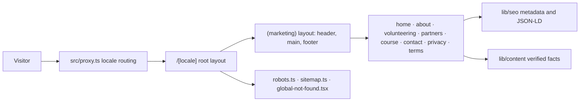

# Web Architecture

## Implemented

A single Next.js 16 App Router application: React 19, strict TypeScript,
Tailwind CSS 4, and `next-intl`. Every marketing page is a Server Component and
is statically generated at build time. There is no API route, database client,
authentication provider, or backend transport.

## Module ownership

| Location | Responsibility |
| --- | --- |
| `src/proxy.ts` | Sends a prefix-less URL to a locale using `Accept-Language`; the only non-static code path |
| `src/app/[locale]/layout.tsx` | Root document, `lang`, typeface, and the client message subset |
| `src/app/[locale]/(marketing)/layout.tsx` | Skip link, header, main landmark, footer |
| `src/app/[locale]/(marketing)/*/page.tsx` | The eight public pages |
| `src/app/robots.ts`, `src/app/sitemap.ts` | Crawl policy and the localized sitemap |
| `src/app/global-not-found.tsx` | 404 for unmatched URLs; required because the root layout sits under a dynamic segment |
| `src/app/globals.css` | Tailwind import, design tokens, base layer, container utility |
| `src/i18n/` | Locale definition, navigation helpers, request config, message catalogs |
| `src/lib/routing/routes.ts` | The single registry of public routes |
| `src/lib/seo/` | Origin helpers, the metadata builder, JSON-LD builders |
| `src/lib/content/` | Verified organisation facts and call-to-action resolution |
| `src/lib/constants/` | External channel resolution and analytics event names |
| `src/components/{ui,brand,marketing}/` | Action styling, brand marks, page composition |

## Rendering rules

Server Components are the default. Two components opt into the client, and both
receive their copy as props so no page-level translation reaches the browser:

- `LocaleSwitcher` needs the active locale and pathname.
- `MobileNav` needs disclosure state and an Escape handler.

The root layout hands `NextIntlClientProvider` only the `nav` namespace.
Forwarding the whole catalog embedded every page's copy in every document:
95KB of raw HTML on the home page against 79KB, and 16.0KB gzipped against
11.4KB. Check for a regression by grepping a rendered page for a string that
only exists on another page.

Every page calls `setRequestLocale` before reading translations. Without it the
route opts out of static generation.

## Configuration decisions

| Setting | Where | Why |
| --- | --- | --- |
| `localePrefix: "always"` | `src/i18n/routing.ts` | One locale per URL, so a canonical URL can never render two languages |
| `localeCookie: false` | `src/i18n/routing.ts` | The URL is the only language state; every response stays cacheable and the privacy page can truthfully say nothing is stored |
| `alternateLinks: false` | `src/i18n/routing.ts` | Alternates are emitted by the metadata layer instead, so they live with the canonical URLs rather than in a response header |
| `timeZone: "Asia/Tashkent"` | `src/i18n/request.ts` | Fixed, so server and client format dates identically for every visitor |
| `experimental.globalNotFound` | `next.config.ts` | The root layout sits under `[locale]`, so a 404 for an unmatched URL cannot be composed from a layout |
| Proxy `matcher` | `src/proxy.ts` | Skips API routes, Next internals, and anything containing a dot, so static assets never pay for a proxy hop |

`global-not-found.tsx` bypasses the layout tree, which is why it re-imports the
global stylesheet and the typeface. It sits outside `[locale]` and cannot know
which language the visitor wanted, so it answers in all three and offers a home
link for each.

## Dependency boundary

Runtime dependencies are `next`, `react`, `react-dom`, `next-intl`,
`class-variance-authority`, `clsx`, `tailwind-merge`, and `lucide-react`.

Removed during the production consolidation because nothing imported them:
`i18next`, `react-i18next`, `i18next-browser-languagedetector`, `next-themes`,
`three`, `@types/three`, `motion`, `@radix-ui/react-accordion`, and
`tw-animate-css`. The site ships one light theme, CSS-only motion, and no WebGL.

Do not add application dependencies here: no TanStack, React Hook Form, Zod,
Zustand, nuqs, openapi-fetch, next-safe-action, jose, drag-and-drop, chart, PDF,
or auth packages. A future contact form may justify a small validation stack,
but only once the form is a real requirement.

## Presented, not implemented

Opportunity browsing, Telegram sign-in, profiles, applications, essays,
volunteer records, and administration belong to the separate YVC application.
This repository explains them and links to them; it does not implement them, and
it holds no illustrative sample data.

## Needs verification

- Backend framework, API origin, endpoint shapes, and error contracts
- Hosting provider and deployment topology
- Analytics, observability, and error reporting choices
