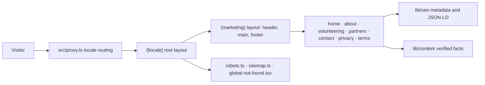

# Web Architecture

## Implemented

A single Next.js 16 App Router application: React 19, strict TypeScript,
Tailwind CSS 4, and `next-intl`. Every marketing page is a Server Component and
is statically generated at build time. There is no API route, database client,
authentication provider, or backend transport.



## Module ownership

| Location | Responsibility |
| --- | --- |
| `src/proxy.ts` | Sends a prefix-less URL to a locale using `Accept-Language`; the only non-static code path |
| `src/app/[locale]/layout.tsx` | Root document, `lang`, typeface, and the client message subset |
| `src/app/[locale]/(marketing)/layout.tsx` | Skip link, header, main landmark, footer |
| `src/app/[locale]/(marketing)/*/page.tsx` | The seven public pages |
| `src/app/robots.ts`, `src/app/sitemap.ts` | Crawl policy and the localized sitemap |
| `src/app/global-not-found.tsx` | 404 for unmatched URLs; required because the root layout sits under a dynamic segment |
| `src/app/globals.css` | Tailwind import, design tokens, base layer, container utility |
| `src/i18n/` | Locale definition, navigation helpers, request config, message catalogs |
| `src/lib/routing/routes.ts` | Framework-agnostic public route registry and locale-relative path builders |
| `src/lib/seo/` | Origin and absolute URL helpers, metadata, and JSON-LD builders |
| `src/lib/content/` | Verified organisation facts, call-to-action resolution, and provisional header navigation |
| `src/lib/theme.ts` | Theme preference, the inline boot script, and the `data-motion` flag |
| `src/lib/map/` | Generated region geometry, localised region names, SVG path helpers |
| `src/lib/constants/` | Validated external channel configuration |
| `src/components/{ui,brand,marketing}/` | Action styling, brand marks, page composition |

The exhaustive file ownership map is in
[`REPOSITORY_INVENTORY.md`](REPOSITORY_INVENTORY.md).

## Dependency direction

The route registry owns only route identity, navigation flags, sitemap values,
and locale-relative paths. `src/lib/seo/urls.ts` depends on that registry to
build canonical and alternate URLs; routing does not depend on SEO, environment
configuration, or Next.js metadata types. Pages compose components and policy
helpers. Components may depend on `lib` and `i18n`, while neither `lib` nor
`i18n` may import a page or marketing component.

`src/lib/content/cta.ts` is the one policy join between configured external
destinations and route fallbacks. A join action may fall back to `/contact`.
Application-only actions return `null` while the application origin is unset,
so callers cannot accidentally render a product link that does not exist.

`src/components/marketing/page-breadcrumb-json-ld.tsx` owns the repeated
home-to-current-page breadcrumb shape. The pure JSON-LD builders remain under
`lib/seo`; the component supplies localized navigation labels.

## Deliberately large modules

Four files are large for structural reasons and should not be split by line
count alone:

- `src/app/globals.css` is the ordered Tailwind token, base, component-motion,
  theme, reduced-motion, and print surface. Splitting it would make cascade
  ownership harder to audit.
- `src/components/marketing/hero-map/hero-map-stage.tsx` owns one coupled DOM
  measurement and scroll lifecycle. Extract a controller only if another stage
  needs the same lifecycle or focused controller tests become necessary.
- `src/components/marketing/hero-map/scene.ts` is the dynamically imported
  Three.js boundary. Keeping scene allocation, palette changes, projection, and
  disposal together makes its resource lifetime explicit.
- `src/lib/map/region-geometry.ts` is generated data; change the generator, not
  the output by hand.

The home page is a composition root. Repeated visible sections belong in shared
components only when at least two pages use the same semantic and visual
contract; page-specific sequencing stays in the page.

## Rendering rules

Server Components are the default. Nine components opt into the client, and all
of them receive their copy as props so no page-level translation reaches the
browser:

- `LocaleSwitcher` needs the active locale and pathname.
- `NavTabs` needs the pathname to mark the active tab.
- `ThemeToggle` needs the document's theme and a click handler.
- `MobileNav` needs disclosure state and an Escape handler.
- `HeroMapStage` owns the home page's hero, its scroll runway, and the canvas.
- `RollingWords` cycles the region label while respecting reduced motion.
- `CountUp` animates verified figures when they enter the viewport.
- `SceneObserver` and `SmoothScroll` render nothing and own one browser API
  each: the entry observer and `lenis`.

The root layout gives `NextIntlClientProvider` `messages={null}`. It carries the
locale context needed by `useLocale` and locale-aware navigation hooks, but no
translation catalog is serialized to the browser; every interactive component
receives its visible labels from a Server Component. An earlier whole-catalog
provider embedded every page's copy in every document: 95KB of raw home-page
HTML and 16.0KB gzipped, versus 79KB and 11.4KB after narrowing it to `nav`.
The current no-message boundary is smaller still and should be checked by
grepping a rendered page for a string that exists only on another page.

Every page calls `setRequestLocale` before reading translations. Without it the
route opts out of static generation.

## The hero map

The home page opens on a scroll-driven relief map of Uzbekistan's fourteen
regions, and it is the only WebGL surface on the site. The hero and the map are
one pinned sequence rather than two sections, and it runs in three acts. A blue
survey rule expands across the frame and travels upward, opening a shutter into
the map as the hero copy retires. The map then lifts all fourteen regions out of
the base plate, and only once every region is up does the board settle upward
into its final rake to make room for the caption and the region index beneath
it. North stays up throughout: the board tips towards the reader and never
rotates about any other axis, so the country's silhouette is recognisable in
every frame. It is built directly on `three`; there is no React
renderer for it, because the scene is a fixed set of meshes driven by one number
and pinning `@react-three/fiber` would tie this repository's React version to
that package's peer range.

| File | Responsibility |
| --- | --- |
| `scripts/build-region-geometry.mjs` | Regenerates the geometry from Natural Earth; run by hand, not in the build |
| `src/lib/map/region-geometry.ts` | Generated: simplified, projected rings and pin anchors |
| `src/lib/map/regions.ts` | Joins the geometry to Uzbek, Russian and English names, plus the locative form the eyebrow reads |
| `src/lib/map/svg-path.ts` | Rings to SVG path data, shared with the fallback |
| `hero-map-section.tsx` | Server: resolves hero copy, caption and region names |
| `hero-map-flat.tsx` | Server: the plan-view SVG everything falls back to |
| `hero-map-stage.tsx` | Client: the sticky runway, scroll progress, the room measured from the DOM, copy layers, pins, region index |
| `timeline.ts` | The three acts as pure curves; imported by the scene and the stage, covered by unit tests |
| `framing.ts` | The frame each act fits the map into and the exact perspective fit; pure functions covered by unit tests |
| `scene.ts` | The three.js scene; imported dynamically, so it is its own chunk |

Three properties are load-bearing:

- **The section is never blank.** The plan-view SVG is server-rendered and stays
  visible until the canvas reports itself ready. Screenshot pipelines, print,
  crawlers, and browsers without WebGL all keep a finished picture. This costs
  about 9KB gzipped on the home page document and is the reason for it.
- **three.js is not in the initial bundle.** `scene.ts` is imported inside an
  `IntersectionObserver` callback, so the 81KB gzipped chunk is fetched only
  when the section approaches the viewport, and never on any other page.
- **The animation's limit is the next section.** Progress is measured from the
  section's own box against the sticky panel's height, so it reaches 1 exactly
  as the panel releases.
- **The runway only exists once the scene does.** The section is a normal-height
  block until `HeroMapStage` has a working canvas, so a visitor without
  JavaScript or WebGL gets the hero, the plan-view map and the caption stacked
  in flow rather than two viewports of dead scroll. The switch into the runway
  is committed with `flushSync`, so the sticky layout exists before the first
  progress read rather than a frame later.

Under `prefers-reduced-motion` the section never pins. The scene renders one
frame with the country tipped and every region lifted, and the hero copy and
caption both stay at full opacity in normal flow.

### The three acts

One scroll progress value, measured from the section's own box, drives
everything. The schedule lives in `timeline.ts` as pure functions, so the acts
can be asserted without a canvas; `scene.render()` returns the same curves the
component needs.

| Progress | Act | What happens |
| --- | --- | --- |
| 0 → 0.30 | `emerge` | A survey rule expands and opens the map upward from the lower frame. The board rises into a near plan view as the hero copy retires behind the handoff. |
| 0.32 → 0.70 | `reveal` | All fourteen regions lift off the base plate one at a time, west to east, each raising a leader line and its numbered pin, while the board tips to 33°. |
| 0.76 → 0.94 | `settle` | The board tips on to 46° and rises into the settled frame — the part of the panel above the caption — while the caption and the region index rise in beneath it. The final 6% of the runway holds the finished composition, so it is at rest when the panel releases. |

The gap between the acts is the point. Settling the board while regions were
still appearing meant a reader who looked away for a second never saw the east
of the country arrive, so the reveal finishes before the settle begins — an
invariant `timeline.test.ts` asserts directly rather than leaving it to the
constants.

The closing act settles rather than turns. An earlier version rotated the board
84° about its own normal and slid it to the right of the frame at the close. The
country became an unrecognisable vertical sliver, the caption's side column only
existed on wide viewports, and on a phone the board rose off the top of the
frame. Every act now keeps north up and the board centred on the frame's
vertical axis; the caption gets its room because the board moves up and its
frame shrinks, which is the direction the reader is already scrolling.
`timeline.test.ts` pins the tip as the only rotation, and `framing.test.ts`
pins the horizontal centre through every act.

Copy layers are absolutely positioned while pinned, so the hero occupying its
full height cannot push the caption out of a fixed-height panel. The hero layer
is marked `inert` once it has faded, because a control that cannot be seen must
not be reachable by keyboard; the caption layer never is, because it carries the
region index that names the map for assistive technology and has nothing
focusable in it.

### Reading the board

The relief reads as white province faces on a solid blue board. `readPalette()`
takes the plate top from `--color-primary` and its wall from `--color-primary-deep`,
the tiles from `--color-surface-soft` with `--color-primary-muted` walls, so the
constant inset between tiles shows as a blue seam and the exposed plate under a
lifted tile shows as blue depth. Nothing in the scene is a literal colour, which
is also why the dark theme costs the scene nothing: the stage watches
`data-theme` on `<html>`, calls `setPalette()` with a fresh `readPalette()`, and
repaints. In the dark the same geometry reads as navy faces with lit blue
edges.

`MeshLambertMaterial` divides irradiance by π, so light intensities that look
reasonable as fractions of one render the whole map as flat grey. The four
lights are tuned so a tile top lands just past 1 — white stays white and the
walls stay a readable step below it — which is why the numbers are around 1–3
rather than around 1. The hemisphere light is positioned toward `+z` rather than
world up, because the map lies in XY and a world-up hemisphere puts its ground
colour on every tile face.

### Showing the regions

Regions are not marked with pins stuck into a flat map. The map is built as a
base plate with the fourteen regions as separate tiles sitting on it, each
inset from its neighbours by a constant *distance* — the inset is computed per
region from its own radius, so a hairline gap reads the same on Karakalpakstan
and on Tashkent city. As progress runs, the tiles lift off the plate and the
gap under them opens, which is what makes the country legible as fourteen
pieces from a raked angle. A thin leader line and a small marker carry each
region's numbered pin up from the tile it belongs to.

Every tile lifts to the same height and every marker is identical. Encoding
region area or anything else in that height would read as a claim about
activity that nothing in `src/lib/content/org.ts` supports.

### How the scene is put together

The country lies in XY with `+x` east and `+y` north, and every region is
extruded along `+z`. The camera stays on the `+z` axis and never orbits; the map
tips because one group rotates about its own x axis, and that is the only
rotation in the scene. It is also the only formulation with no gimbal
degeneracy at plan view, where an orbiting camera's up vector goes parallel to
its view direction.

Framing is a window in panel pixels, not a camera position. `framing.ts`
defines one frame per act and `frameFor()` interpolates between them on the act
curves, so a frame is never chosen by viewport aspect or by special-casing a
breakpoint:

| Frame | Where it is |
| --- | --- |
| backdrop | From the measured bottom of the hero copy plus a gap down to one panel height further, top-aligned, so the map hangs from under the buttons on every width and is cropped by the bottom edge |
| stage | The whole panel inside the room kept for pins — 44px at the sides, 40px above, 32px below |
| settled | The stage frame with its bottom raised by the caption layer's measured height plus a gap |

`fitCamera()` solves the perspective fit exactly. For every silhouette point —
the convex hull of the country at plate level and again at the top of the
tallest leader, plus each leader's own position — it computes the camera
distance that keeps that point inside the frame *at its own depth*, then the
offset that lands the hull's centre on the frame's centre, or its topmost point
on the frame's top edge for a top-aligned frame. The map group is what moves;
the camera only backs off. `framing.test.ts` projects a slab through the
returned fit and asserts it lands inside the frame and touches it.

Two details of the silhouette matter:

- the fit is solved against the **convex hull** of the country outline, not its
  bounding box, because the box has corners the country never reaches — at a
  phone's aspect ratio that cost about a third of the usable width;
- each point's own depth sets its distance requirement, because the points that
  stick out sideways are not the ones nearest the camera once the map is tipped.

The stage measures the room from the DOM rather than guessing it. The hero
copy's bottom, the caption's height and the pins' boxes are read on every
resize — a `ResizeObserver` watches the stage, the caption and the hero copy —
so a longer Russian caption or a late font swap changes the frames instead of
overlapping the map. Inside the frame loop nothing is read from layout except
the projected pin heads.

Progress is eased towards the scroll position with a 90ms time constant, in
elapsed time rather than per frame, so the motion reads the same at 60Hz and
120Hz. A resize repaints the current frame directly and leaves the animation
loop alone; the earlier per-frame step doubled its speed after every resize
because a repaint also queued a second loop.

Every pin is identical. Region area is deliberately not encoded in pin height or
size: a taller pin would read as a claim about activity in that region, and
nothing in `src/lib/content/org.ts` supports one.

### Naming the regions

Names are not written on the map. Fourteen name chips over a board that tips
and moves cannot all fit: on a phone they overlap at any angle, and the
collision solver that used to place them earned its keep by *hiding* the losers,
so the regions a reader most wanted to find were the ones that disappeared.

The map instead carries a numbered pin per region, and the names live in an
index beside the caption — numbered west to east, so the list reads in the order
the regions rise. A pin is a 24px disc rather than a 140px chip, which is small
enough that collisions are rare, and when two do clash the loser moves rather
than vanishes. The index is ordinary server-rendered `<ol>` markup, so every
name is present without JavaScript, at any width, in all three locales; it is
also what a screen reader reads, replacing the `sr-only` list that used to
shadow the map.

Pins are DOM, not WebGL, positioned each frame from the projected pin heads. The
canvas places them topmost first and tries nine slots — the head itself, then
four orthogonal and four diagonal neighbours — measuring the real boxes. The
fallback estimates its boxes from character count, because it is solved on the
server.

The fallback names its regions on the map, because it is a still picture with
nothing to move out of the way, and it drops any name that will not fit. Its
labels are HTML rather than SVG `<text>` for the same reason the pins are: SVG
text scales with the drawing, which would be unreadable on a phone and oversized
on a desktop. Locking the fallback's box to the map's aspect ratio is what lets
those labels be positioned in percentages.

### Data

The geometry source is Natural Earth 1:10m Admin 1, which is public domain, so
the repository carries no attribution obligation — the same data from
geoBoundaries is ODbL, which would have added one. The raw file is ~40MB and is
not committed; only the simplified output is. Rings are simplified with
Ramer–Douglas–Peucker, projected equirectangular at 41.5°N, normalised into a
centred space two units wide, and rounded to three decimals, which is sub-pixel
at any size this renders at. That is 661 points for the whole country.

To regenerate after changing a constant in the script:

```bash
node scripts/build-region-geometry.mjs path/to/ne_10m_admin_1_states_provinces.geojson
```

## Entry scenes

Every section below the hero enters once, on time, as it comes into view. The
system is three small parts and one attribute.

**The boot script.** `THEME_BOOT_SCRIPT` in `src/lib/theme.ts` runs inline in
`<head>` before first paint. It sets `data-theme` and, unless the visitor asked
for reduced motion, `data-motion` on `<html>`. Every hidden state in the
stylesheet is scoped under `html[data-motion]`, so a document without
JavaScript, a visitor with reduced motion, and a print render all see the page
complete with no rule applying at all.

**The markup.** `Scene` (`src/components/marketing/scene.tsx`) is a server
component that renders `data-scene` and a variant class: `scene-rise` for a
block, `scene-stagger` for a list whose direct children follow one another at
80ms, `scene-wipe` for the closing panel, and `scene-group` for a boundary whose
actors set their own classes. `SplitWords` wraps each word of a heading in a
clipped `scene-word` slot carrying its index in `--i`; the accessible name is
untouched because the spaces stay as text nodes. `scene-rule` marks a hairline
that draws in. Delays are custom properties (`[--scene-delay:340ms]`), never
style objects.

**The observer.** `SceneObserver` mounts once in the marketing layout, creates
one `IntersectionObserver` with a `-12%` bottom margin (jamals.uz's "top 88%"),
and marks each `[data-scene]` with `data-in` the first time it intersects. It
rescans on every pathname change, and any scene already above the viewport at
scan time is marked entered immediately, so a reload half-way down a page never
leaves the top half hidden.

**The CSS.** The transitions animate `opacity`, the individual `translate` and
`scale` properties, and `clip-path`, on one curve (`--ease-scene`) at around a
second. Using `translate` rather than `transform` matters: the work-field route
already carries `transform: translateX(-50%)`, and an entry that wrote
`transform` would have moved it. The two heroes cannot wait for hydration, so
they use the `enter-rise` and `enter-words` keyframes instead, which play on
load with the same curve and delays.

What still scrubs with the scroll position is deliberate, and unchanged:

| Class | Used for |
| --- | --- |
| `work-field-*` | The home page responsibility route carries one blue signal through six fully visible items |
| `process` / `rail-line` / `rail-head` / `process-node` / `process-content` | The step rail runs as a process: the connector fills, a head travels along it, and each step lights as the head reaches it |
| `marquee` | The partner and source rows roll continuously, pausing on hover and focus |

Only two things below the hero are not CSS. `CountUp` needs a formatted number
on every frame, and `RollingWords` needs to mount a new word and retire the old
one, so both are small client components; everything they animate is still a CSS
transition or keyframe.

Two rules govern where scenes go. Do not nest one `Scene` inside another: the
outer boundary's hidden state matches the inner actors too, so they would wait
for both. And `overflow: hidden` is never used on an ancestor of a
scroll-driven element: `hidden` makes an element a scroll container, so
`view()` resolves against that box instead of the viewport and the animation is
finished before it is ever seen. Where clipping is needed above one of these —
the footer signature's band, and the mask each letter or word rises out of — it
is `overflow: clip`, which clips without becoming a scroll container.

## Smooth scrolling

`SmoothScroll` mounts `lenis` with `autoRaf` and anchor handling offset by the
header height, and only when `data-motion` is set. Lenis drives the native
scroll position, so `scroll` events, `IntersectionObserver`, the hero map's
progress read and every CSS scroll timeline keep working unchanged; touch keeps
native momentum. The base layer carries the four Lenis rules (natural height,
no native smooth scrolling while Lenis is active, contained overscroll in
`[data-lenis-prevent]`, clipped overflow while stopped).

The footer signature is the one scene that waits for the reader to arrive
rather than approach. `Scene` takes `trigger="full"`, and the observer watches
that band with `threshold: 1`, so the wordmark writes itself letter by letter,
the head pops and the two hands sweep up only once the whole band is on screen
— which, for the last band on the page, means the reader has reached the
bottom, as on wisprflow.ai. A band taller than the viewport falls back to the
ordinary entry trigger so it can never wait forever.

One place does not animate against its own box, and it names a timeline on an
ancestor instead.

The step rail has a sharper reason. From the large breakpoint its four steps sit
side by side, so their own view timelines are identical and `view()` would light
all four at once — there would be no process to watch. The list carries
`view-timeline-name: --process`, the connector and the travelling head run the
full window, and each step takes a slice of it through `:nth-of-type`, which
counts the `li` elements and ignores the rail spans in front of them. One
timeline, five staggered readers, and the sequence survives the layout changing
from a column to a row.

Reduced motion is handled twice, on purpose: the boot script withholds
`data-motion`, which keeps every scene visible and Lenis unmounted, and a single
CSS block sets `animation: none` on the scrubbed classes, hides the marquee's
duplicate track and lets the row scroll by hand instead.

## Keeping motion off the GPU's back

Ambient motion runs forever, so anything it touches is paid for forever. Four
rules came out of measuring the home page while idle, and they are the reason
the ambient layer is written the way it is.

**Nothing animates a layout property.** The channel pulse animated `top`, so
four infinite animations ran layout on every frame. It translates now, and
`.backdrop-channel` carries `container-type: size` purely so the keyframe can
say `100cqh` — the parent's height — which a percentage `translate` cannot
express.

**Nothing paints where compositing would do.** The event card's tick animated
`stroke-dashoffset`, which repaints the SVG every frame; it fades instead. The
marquee's edge fades were a `mask-image` over a continuously translating track,
which costs an offscreen pass every frame; they are two painted gradients on top
now, and `--marquee-edge` carries the section's background colour so the fade
still matches whatever tone the row sits on.

**No permanent `will-change`.** It was on the marquee tracks and on all fourteen
hero-map pins, which is fifteen compositor layers held for the life of the
page to animate things the browser promotes on its own anyway. Nothing on the
site sets it.

**No `backdrop-filter` on the sticky header.** It sat behind a 95% opaque
background, so it was invisible, and a full-width backdrop filter on a sticky
element is recomputed on every scroll frame. Safari in particular does not
forgive that one.

`content-visibility: auto` looks like the answer for the ambient layers and is
not: measured on the absolutely positioned backdrops and on the marquees, it
never engaged, at any scroll offset. It was removed rather than left in as
decoration. The loops still run off screen; they are simply cheap enough now
that it does not matter.

The scene's own budget is separate. The canvas caps **total device pixels** at
2.6M rather than capping the device pixel ratio, because a ratio cap means a
laptop pays four times a phone's fragment cost for the same picture. A phone
keeps its full ratio; a 1728px window renders at about 1.28x instead of 2x, and
the map is flat-shaded enough that the difference is invisible.

## Configuration decisions

| Setting | Where | Why |
| --- | --- | --- |
| `localePrefix: "always"` | `src/i18n/routing.ts` | One locale per URL, so a canonical URL can never render two languages |
| `localeCookie: false` | `src/i18n/routing.ts` | The URL is the only language state; every response stays cacheable and the privacy page can truthfully say nothing is stored |
| `alternateLinks: false` | `src/i18n/routing.ts` | Alternates are emitted by the metadata layer instead, so they live with the canonical URLs rather than in a response header |
| `timeZone: "Asia/Tashkent"` | `src/i18n/request.ts` | Fixed, so server and client format dates identically for every visitor |
| `experimental.globalNotFound` | `next.config.ts` | The root layout sits under `[locale]`, so a 404 for an unmatched URL cannot be composed from a layout |
| Proxy `matcher` | `src/proxy.ts` | Skips API routes, Next internals, and anything containing a dot, so static assets never pay for a proxy hop |
| Theme in `localStorage`, not a cookie | `src/lib/theme.ts` | A cookie would reach the server and tempt a per-request render; the inline boot script applies the stored value before paint and every page stays static |

`global-not-found.tsx` bypasses the layout tree, which is why it re-imports the
global stylesheet and the typeface. It sits outside `[locale]` and cannot know
which language the visitor wanted, so it answers in all three and offers a home
link for each.

## Dependency boundary

Runtime dependencies are `next`, `react`, `react-dom`, `next-intl`,
`class-variance-authority`, `clsx`, `tailwind-merge`, `lucide-react`, `lenis`,
which does smooth scrolling and nothing else, and `three`, which is isolated to
the hero map.

Removed during the production consolidation because nothing imported them:
`i18next`, `react-i18next`, `i18next-browser-languagedetector`, `next-themes`,
`motion`, `@radix-ui/react-accordion`, and `tw-animate-css`. Two of those were
considered again when the entry scenes and the dark theme were built and
declined again: `next-themes` is forty lines of `src/lib/theme.ts`, and an
animation library would have cost more than every scene on the site put
together. Themes are a data attribute, interface motion is CSS plus one
observer, and WebGL stays confined to the hero map.

Do not add application dependencies here: no TanStack, React Hook Form, Zod,
Zustand, nuqs, openapi-fetch, next-safe-action, jose, drag-and-drop, chart, PDF,
or auth packages. A future contact form may justify a small validation stack,
but only once the form is a real requirement.

## Presented, not implemented

Opportunity browsing, Telegram sign-in, profiles, applications, essays,
volunteer records, and administration belong to the separate Volontyorlar application.
This repository explains them and links to them; it does not implement them, and
it holds no illustrative sample data.

## Needs verification

- Backend framework, API origin, endpoint shapes, and error contracts
- Hosting provider and deployment topology
- Analytics, observability, and error reporting choices
