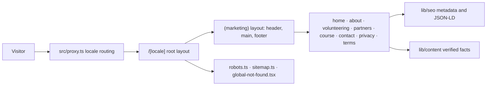

# Web Architecture

## Implemented

A single Next.js 16 App Router application: React 19, strict TypeScript,
Tailwind CSS 4, and `next-intl`. Every marketing page is a Server Component and
is statically generated at build time. There is no API route, database client,
authentication provider, or backend transport.



## Module ownership

| Location | Responsibility |
| --- | --- |
| `src/proxy.ts` | Sends a prefix-less URL to a locale using `Accept-Language`; the only non-static code path |
| `src/app/[locale]/layout.tsx` | Root document, `lang`, typeface, and the client message subset |
| `src/app/[locale]/(marketing)/layout.tsx` | Skip link, header, main landmark, footer |
| `src/app/[locale]/(marketing)/*/page.tsx` | The eight public pages |
| `src/app/robots.ts`, `src/app/sitemap.ts` | Crawl policy and the localized sitemap |
| `src/app/global-not-found.tsx` | 404 for unmatched URLs; required because the root layout sits under a dynamic segment |
| `src/app/globals.css` | Tailwind import, design tokens, base layer, container utility |
| `src/i18n/` | Locale definition, navigation helpers, request config, message catalogs |
| `src/lib/routing/routes.ts` | The single registry of public routes |
| `src/lib/seo/` | Origin helpers, the metadata builder, JSON-LD builders |
| `src/lib/content/` | Verified organisation facts and call-to-action resolution |
| `src/lib/map/` | Generated region geometry, localised region names, SVG path helpers |
| `src/lib/constants/` | External channel resolution and analytics event names |
| `src/components/{ui,brand,marketing}/` | Action styling, brand marks, page composition |

## Rendering rules

Server Components are the default. Three components opt into the client, and all
of them receive their copy as props so no page-level translation reaches the
browser:

- `LocaleSwitcher` needs the active locale and pathname.
- `MobileNav` needs disclosure state and an Escape handler.
- `RegionMapStage` owns the home page's scroll runway and the WebGL canvas.

The root layout hands `NextIntlClientProvider` only the `nav` namespace.
Forwarding the whole catalog embedded every page's copy in every document:
95KB of raw HTML on the home page against 79KB, and 16.0KB gzipped against
11.4KB. Check for a regression by grepping a rendered page for a string that
only exists on another page.

Every page calls `setRequestLocale` before reading translations. Without it the
route opts out of static generation.

## The region map

The home page carries a scroll-driven relief map of Uzbekistan's fourteen
regions, and it is the only WebGL surface on the site. It is built directly on
`three`; there is no React renderer for it, because the scene is a fixed set of
meshes driven by one number and pinning `@react-three/fiber` would tie this
repository's React version to that package's peer range.

| File | Responsibility |
| --- | --- |
| `scripts/build-region-geometry.mjs` | Regenerates the geometry from Natural Earth; run by hand, not in the build |
| `src/lib/map/region-geometry.ts` | Generated: simplified, projected rings and pin anchors |
| `src/lib/map/regions.ts` | Joins the geometry to Uzbek, Russian and English names |
| `src/lib/map/svg-path.ts` | Rings to SVG path data, shared with the fallback |
| `region-map-section.tsx` | Server: resolves copy and names, composes the two below |
| `region-map-flat.tsx` | Server: the plan-view SVG everything falls back to |
| `region-map-stage.tsx` | Client: the sticky runway, scroll progress, label layer |
| `scene.ts` | The three.js scene; imported dynamically, so it is its own chunk |

Three properties are load-bearing:

- **The section is never blank.** The plan-view SVG is server-rendered and stays
  visible until the canvas reports itself ready. Screenshot pipelines, print,
  crawlers, and browsers without WebGL all keep a finished picture. This costs
  about 9KB gzipped on the home page document and is the reason for it.
- **three.js is not in the initial bundle.** `scene.ts` is imported inside an
  `IntersectionObserver` callback, so the 81KB gzipped chunk is fetched only
  when the section approaches the viewport, and never on any other page.
- **The animation's limit is the next section.** Progress is measured from the
  section's own box against the sticky panel's height, so it reaches 1 exactly
  as the panel releases.

Under `prefers-reduced-motion` the scene renders one frame at its final state
and never couples to scroll.

### How the scene is put together

The country lies in XY with `+x` east and `+y` north, and every region is
extruded along `+z`. The camera stays on the `+z` axis and never orbits; the map
tips because one group rotates about its own x axis. That is both what the design
asks for — the map turns sideways — and the only formulation with no gimbal
degeneracy at plan view, where an orbiting camera's up vector goes parallel to
its view direction.

Framing is recomputed every frame from the rotated silhouette rather than from
fixed camera positions. The tip and the turn both change what the map occupies,
so a fixed distance either crops the Fergana valley off the right edge at full
tip or wastes most of the frame at plan view. Two details matter:

- the fit is solved against the **convex hull** of the country outline, not its
  bounding box, because the box has corners the country never reaches — at a
  phone's aspect ratio that cost about a third of the usable width;
- each point's own depth sets its distance requirement, because the points that
  stick out sideways are not the ones nearest the camera once the map is tipped.

Every pin is identical. Region area is deliberately not encoded in pin height or
size: a taller pin would read as a claim about activity in that region, and
nothing in `src/lib/content/org.ts` supports one.

### Labels

Region labels are DOM, not WebGL, positioned each frame from the projected pin
heads. Both the canvas and the fallback place labels largest-region-first and
drop any that would overlap one already placed, so the Fergana valley — five
regions inside a couple of centimetres — reads as a designed subset rather than
a pile of overlapping chips. The canvas measures the real boxes; the fallback
has to estimate them from character count, because it is solved on the server.

The fallback's labels are HTML rather than SVG `<text>` for the same reason: SVG
text scales with the drawing, which would be unreadable on a phone and oversized
on a desktop. Locking the fallback's box to the map's aspect ratio is what lets
those labels be positioned in percentages.

### Data

The geometry source is Natural Earth 1:10m Admin 1, which is public domain, so
the repository carries no attribution obligation — the same data from
geoBoundaries is ODbL, which would have added one. The raw file is ~40MB and is
not committed; only the simplified output is. Rings are simplified with
Ramer–Douglas–Peucker, projected equirectangular at 41.5°N, normalised into a
centred space two units wide, and rounded to three decimals, which is sub-pixel
at any size this renders at. That is 661 points for the whole country.

To regenerate after changing a constant in the script:

```bash
node scripts/build-region-geometry.mjs path/to/ne_10m_admin_1_states_provinces.geojson
```

## Configuration decisions

| Setting | Where | Why |
| --- | --- | --- |
| `localePrefix: "always"` | `src/i18n/routing.ts` | One locale per URL, so a canonical URL can never render two languages |
| `localeCookie: false` | `src/i18n/routing.ts` | The URL is the only language state; every response stays cacheable and the privacy page can truthfully say nothing is stored |
| `alternateLinks: false` | `src/i18n/routing.ts` | Alternates are emitted by the metadata layer instead, so they live with the canonical URLs rather than in a response header |
| `timeZone: "Asia/Tashkent"` | `src/i18n/request.ts` | Fixed, so server and client format dates identically for every visitor |
| `experimental.globalNotFound` | `next.config.ts` | The root layout sits under `[locale]`, so a 404 for an unmatched URL cannot be composed from a layout |
| Proxy `matcher` | `src/proxy.ts` | Skips API routes, Next internals, and anything containing a dot, so static assets never pay for a proxy hop |

`global-not-found.tsx` bypasses the layout tree, which is why it re-imports the
global stylesheet and the typeface. It sits outside `[locale]` and cannot know
which language the visitor wanted, so it answers in all three and offers a home
link for each.

## Dependency boundary

Runtime dependencies are `next`, `react`, `react-dom`, `next-intl`,
`class-variance-authority`, `clsx`, `tailwind-merge`, and `lucide-react`.

Removed during the production consolidation because nothing imported them:
`i18next`, `react-i18next`, `i18next-browser-languagedetector`, `next-themes`,
`three`, `@types/three`, `motion`, `@radix-ui/react-accordion`, and
`tw-animate-css`. The site ships one light theme, CSS-only motion, and no WebGL.

Do not add application dependencies here: no TanStack, React Hook Form, Zod,
Zustand, nuqs, openapi-fetch, next-safe-action, jose, drag-and-drop, chart, PDF,
or auth packages. A future contact form may justify a small validation stack,
but only once the form is a real requirement.

## Presented, not implemented

Opportunity browsing, Telegram sign-in, profiles, applications, essays,
volunteer records, and administration belong to the separate YVC application.
This repository explains them and links to them; it does not implement them, and
it holds no illustrative sample data.

## Needs verification

- Backend framework, API origin, endpoint shapes, and error contracts
- Hosting provider and deployment topology
- Analytics, observability, and error reporting choices
