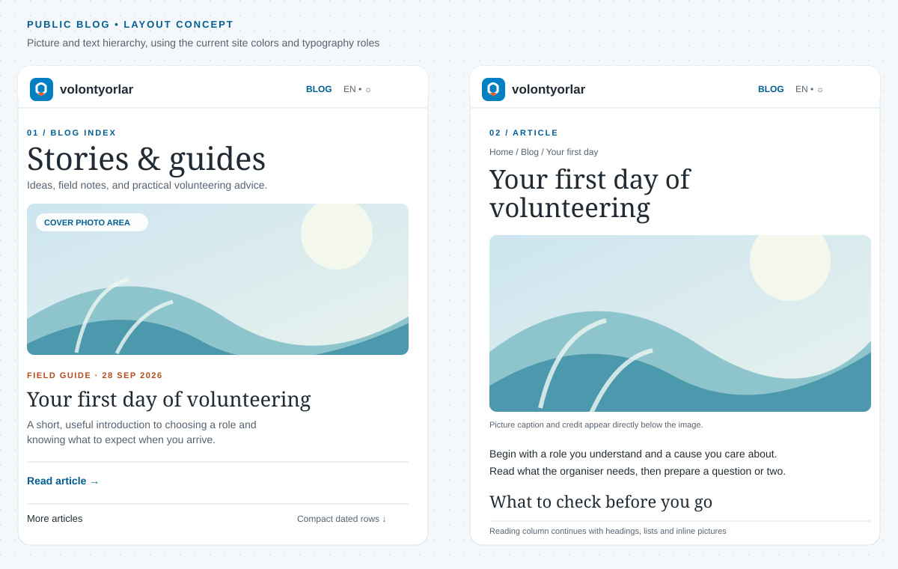
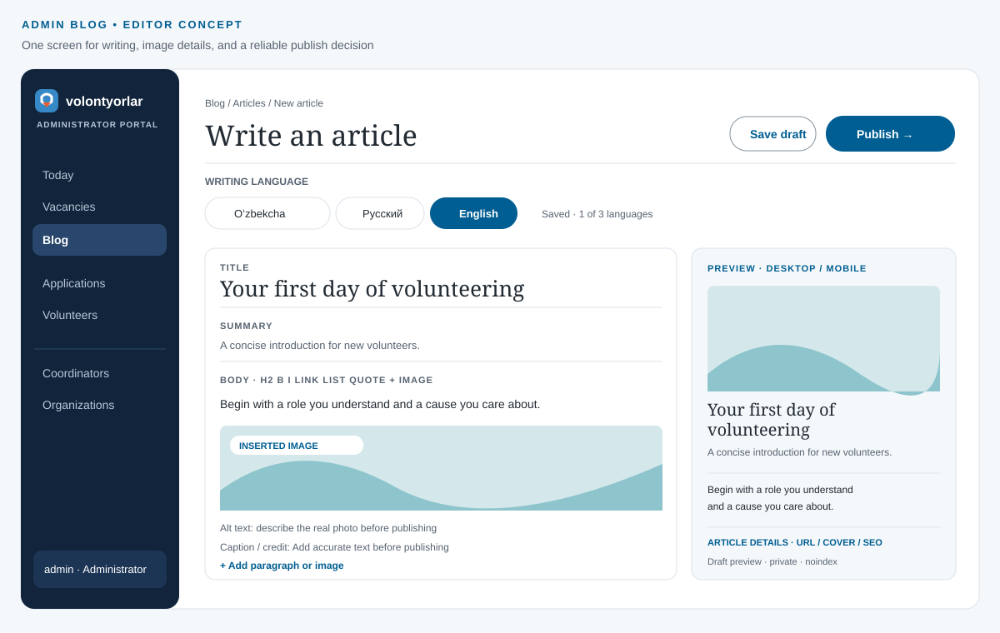

# Volontyorlar blog: implementation plan

Status: implemented in the local workspace on 28 September 2026. The isolated development database has the blog migration; production configuration, migration, and deployments have not been changed.

## Decision and scope

Build the blog into the existing Volontyorlar system: public reading on `volontyorlar.uz`, administrator writing and publishing in `v-admin`, and the content API, permissions, database, and image processing in `v-backend`. This keeps the existing administrator identity and audit trail and avoids introducing a second publishing account system.

The first release supports articles with a cover picture, formatted text, and pictures placed between paragraphs. Administrators alone create, edit, preview, publish, unpublish, and archive articles. An administrator chooses Uzbek, Russian, or English for each version and writes the versions themselves. One published version is enough to publish an article. Missing languages display an existing published version, with a clear language notice.

The two pictures below are layout concepts. They show placement and hierarchy, not final photography or publishable article claims.

## Reader experience

| Surface | Layout and behavior |
| --- | --- |
| `/{locale}/blog` | Add Blog to the existing header and mobile navigation. Start with one lead article and a compact list of recent articles. Each entry has a real cover or a deliberate text-only treatment, title, short summary, and publication date. Use pagination when the list grows. |
| `/{locale}/blog/{slug}` | Show a breadcrumb, title, summary, date, cover image and credit, then a calm reading column with headings, paragraphs, lists, quotations, links, and inline figures with captions. Finish with a back-to-blog link; add related articles only when there is enough real content. |
| Missing translation | Keep the selected language for navigation. Use the primary language when it has a published version; otherwise use the oldest published version, with `uz`, `ru`, `en` as a stable tie-break. Put a notice directly above the title (for example, “This article is available in Uzbek”) and mark the article content with its actual HTML `lang`. The language switcher links to available translations. |
| Empty/error states | The index has an intentional “No articles yet” state. A missing, archived, or unpublished slug returns 404. If the API is unavailable, show a retryable public error rather than an empty list. |

The visual direction extends `v-web/DESIGN.md`: Source Serif 4 for display headings, Onest for reading and controls, the paper/grid ground, blue navigation, and restrained orange accents. Pictures carry the story; avoid decorative imagery, card piles, and motion in the reading column. Keep the same light/dark, keyboard, mobile, and reduced-motion behavior as the existing site.

## Article creation workflow

The editor is a focused writing screen, not a multi-page wizard. The administrator can move between writing, pictures, preview, and publishing without losing the current text.

| Step | Administrator action | System response |
| --- | --- | --- |
| 1. Find or start | Open **Blog** in the portal. The compact list shows title, language badges, Draft/Published/Archived state, last edit, and published date; filter or search in place. **New article** opens the editor directly. | A new article starts in the selected writing language, defaulting to the portal language. There is no slug form before writing. |
| 2. Write | Enter a title, short summary, and body. Use a small contextual toolbar for headings, emphasis, lists, links, and quotes. A `+` between paragraphs inserts an image. | After the first meaningful content, create the draft and derive a short URL slug from its title. Save edits to the backend after a short idle pause and on blur. Show `Saving…`, `Saved at HH:MM`, or a retryable error; keep a visible **Save draft** action. Do not put the article in browser localStorage. |
| 3. Add pictures | Choose a cover, or insert pictures by picker, paste, or drag and drop. Edit alt text, optional caption, and credit beside each picture. Reorder an inline picture with its text. | Show upload progress and a local preview; preserve the article if upload fails and allow retry. A cover is optional for ordinary articles; featured placement requires one. A selected picture cannot publish until upload and required alt text are complete. |
| 4. Manage languages | Switch among Uzbek, Russian, and English tabs. A tab says `Missing`, `Draft`, `Published`, or `Changes to publish`. Open a published language in a read-only reference pane while writing another language. | Each language has its own draft and published revision. Switching tabs saves the current draft first. No machine translation or silent copying occurs. A missing language will show the deterministic fallback on the public site. |
| 5. Preview | Choose **Preview** and inspect desktop and mobile widths, the selected language, and its fallback notice when relevant. | Preview uses the current draft and the real public article renderer, is administrator-only, and uses `noindex` and `no-store`. It is not a public share link. |
| 6. Publish | Choose **Publish this language**. A compact review panel shows the exact language and URL, content summary, picture/alt/credit checks, broken-link warnings, and which language visitors will see when translations are missing. | Block only missing essentials: title, summary, meaningful body, unfinished uploads, missing alt text, invalid links, or unavailable media. Confirming publishes an immutable revision for that language and returns a live link. The other language drafts remain private. |
| 7. Maintain | Edit a published language, compare or restore an earlier saved revision, publish its changes, unpublish one language, or archive the article. | Draft edits never alter the live revision. A version conflict between two administrators asks the later editor to compare and resolve changes. Unpublishing the last language removes the public article. All state changes are audited. |

Keep URL, optional SEO description, and cover controls in an **Article details** panel, rather than putting them in the writing path. The administrator may edit the generated slug until the first publication; after that it is stable. Defer scheduling, tags, newsletter delivery, embeds, and coordinator approvals until there is a demonstrated need.

This flow adopts a few proven patterns without copying a whole CMS: Ghost places preview and publish controls together and supports pictures within the writing flow; WordPress keeps autosaves separate from the published article and offers device previews; Wagtail distinguishes draft and live revisions. Tiptap handles pasted and dropped files but delegates actual upload to the application. [Ghost publishing](https://ghost.org/help/publishing-content/), [Ghost image cards](https://ghost.org/help/cards/), [WordPress revisions](https://wordpress.org/documentation/article/revisions/), [WordPress preview](https://wordpress.org/documentation/article/how-to-use-the-preview-function/), [Wagtail page revisions](https://docs.wagtail.org/en/latest/advanced_topics/api/v3/pages.html), [Tiptap file handling](https://tiptap.dev/docs/editor/extensions/functionality/filehandler).

No coordinator or organization portal controls are added in this release.

## Content and media contract

| Entity | Fields and rules |
| --- | --- |
| `BlogPost` | UUID, globally unique stable slug, primary language, cover media reference, creator, timestamps, archive state. Freeze the slug after first publication; a later rename needs an explicit redirect. |
| `BlogTranslation` | Unique `(postId, locale)` for `uz`, `ru`, `en`. Separate editable draft and immutable published revision; title, summary, constrained body JSON, SEO description, author display name, published/updated timestamps. Published content is never silently changed by saving a draft. |
| `BlogMedia` | UUID, object key, image dimensions, generated variants, upload owner, timestamp, and usage references. Store alt text, caption, and credit in each translated article because those words can differ by language. Never expose storage credentials or raw object keys in public responses. |

Use a constrained rich-text JSON document for the body. A small Tiptap client editor can produce it; the backend must validate allowed nodes, marks, links, media IDs, size, and depth, and the public site renders those nodes through an allowlisted React renderer. Do not trust or render arbitrary saved HTML. Tiptap supports JSON persistence and block images, while its image extension leaves uploading to the application, which suits the existing backend media boundary. [Tiptap JSON guide](https://tiptap.dev/docs/guides/output-json-html), [image extension](https://tiptap.dev/docs/editor/extensions/nodes/image).

Use the existing Sharp image-processing approach and a blog-specific media adapter. In **local development only**, set `BLOG_MEDIA_DRIVER=filesystem` and store generated files under an ignored `v-backend/.local-media/blog/` directory that survives `dist` rebuilds. The local adapter must refuse to start when `NODE_ENV=production`. Keep the current production S3-compatible/R2 storage path and all production environment values unchanged; its blog objects use a separate `blog/` prefix. The local and production environments continue to use the current Redis connection, with local background jobs disabled.

Store a logical media ID and variant names in the database, never an absolute file path. The backend resolves that ID to an allowlisted image file; an administrator preview can read draft media, while a public media request succeeds only when a published revision references it. Do not expose the local directory as a blanket static root or accept a request path as a filesystem path. Generate responsive WebP variants, strip metadata, enforce file-size and pixel limits and decoded image type, and retain dimensions. Public responses contain backend-issued image URLs; article JSON cannot point to arbitrary external image sources. Require an accurate rights/credit check before publishing photographs of identifiable volunteers. Storing files outside a public webroot and mapping opaque IDs to files follows [OWASP file-upload guidance](https://cheatsheetseries.owasp.org/cheatsheets/File_Upload_Cheat_Sheet.html).

## API and site integration

| Repository | Work |
| --- | --- |
| `v-backend` | Add Prisma migration; admin CRUD, translation save, preview, publish/unpublish/archive, and image upload endpoints; public paginated list and slug read endpoints returning only published revisions. Enforce `admin` on every write, validate DTOs, generate OpenAPI, and add audit actions. Return the requested and actual content language when a fallback is used. |
| `v-admin` | Add the Blog list and editor routes, endpoint registry entries, generated API types, Zod response schemas, translated interface strings, upload and preview states, and clear publish confirmations. Keep server-only tokens and the existing gateway pattern. |
| `v-web` | Add localized blog index/article routes, header/mobile navigation, renderer, language notice, image layout, dynamic metadata, article structured data, and dynamic sitemap entries. Fetch public article data server-side; never depend on admin credentials in this repo. |

Suggested endpoint shape: `GET /public/blog`, `GET /public/blog/:slug`, `GET /admin/blog`, `POST /admin/blog`, `GET/PATCH /admin/blog/:id`, `PUT /admin/blog/:id/translations/:locale`, `POST /admin/blog/:id/translations/:locale/publish`, `POST /admin/blog/:id/translations/:locale/unpublish`, `POST /admin/blog/:id/media`, `POST /admin/blog/:id/translations/:locale/preview-session`, and `POST /admin/blog/:id/archive`, plus ID-based public and admin media reads. Draft saves carry a version; a stale version returns `409` with enough information for a compare-and-retry screen. Final paths belong in backend OpenAPI before either frontend consumes them. Public list pagination must have a stable sort (published date, then ID), a bounded page size, and no draft leakage.

For an exact draft preview, add a private `v-web` preview route that uses the same article component as the public page. The admin requests a short-lived, article-and-locale-scoped opaque preview token from the backend and submits it by `POST` to the web preview route in a new tab. The web route checks the admin origin, sets a path-scoped `HttpOnly` preview cookie, and redirects to a clean URL. Each preview read is checked by the backend and is never cached; the token never appears in a URL. This avoids copying the article renderer into the admin repository or exposing the administrator's normal session token to the public site. Token issuance is audited; request logs omit the token and draft body.

Publication and unpublication should invalidate the web's index, article, metadata, and sitemap cache through a signed server-to-server revalidation route, with a short time-based refresh as a fallback. Next.js supports tag-based invalidation for this use case; its metadata and sitemap can be generated from dynamic data. Verify the installed Next.js 16 configuration before coding the exact cache API. [Next.js revalidation](https://nextjs.org/docs/app/api-reference/functions/revalidateTag), [dynamic metadata](https://nextjs.org/docs/app/api-reference/functions/generate-metadata).

For a real translation, set that locale's canonical URL, alternate language links, Open Graph locale, and `BlogPosting` JSON-LD from the published revision. For a fallback route, show the content but use the source language's canonical URL and keep the fallback URL out of the sitemap and `hreflang` cluster; mark that duplicate route `noindex`. Include only actually published translations as alternates. Google treats untranslated main content as a duplicate even if the navigation is translated, and its article guidance recommends representative, crawlable images. [Google localized pages](https://developers.google.com/search/docs/specialty/international/localized-versions), [Google article data](https://developers.google.com/search/docs/appearance/structured-data/article).

## Delivery sequence and acceptance

| Phase | Deliverable | Done when |
| --- | --- | --- |
| 1. Contract and data | Migration, revision model, local filesystem media adapter, image pipeline, admin/public/preview API, OpenAPI | Drafts stay private, permissions reject non-admin writes, fallback selection is deterministic, and one published translation reads publicly. Local filesystem media works while Redis remains as configured. |
| 2. Public rendering | Index, article renderer, private draft preview, navigation, responsive images, locale fallback | Published content appears at `volontyorlar.uz/{locale}/blog`; a missing translation visibly falls back; unpublished content is absent; a draft preview uses the same article renderer without becoming public. |
| 3. Admin publishing | Compact list, title-first editor, image upload, autosave, revisions, device preview, publish review | An administrator can write a mixed text-and-picture article, publish one language, update it without changing the live revision until publish, and recover from failed save or upload. Desktop/mobile, light/dark, keyboard, and reduced-motion views are usable. |
| 4. Search and release | Metadata, `hreflang`, JSON-LD, sitemap, cache invalidation, deployment | Publish/unpublish propagates to article/index/sitemap; crawlers see only real translated versions; the live backend revision, migration, media, and public page are checked after release. |

The implementation uses the isolated development database. The local media directory is ignored by Git, and the filesystem adapter is active only in the shared local backend environment. Production Redis, production media settings, and other production configuration are unchanged. The development migration has been applied. Production schema changes and deployment remain a separate reviewed release step.

Implementation notes: the title-first form creates the draft after the title is entered. Each backend draft save creates a recoverable revision. The editor shows a text comparison for a version conflict or an earlier revision before restoring it. Uploads display a pending state and a retryable local picture preview; they do not display a percentage because the authenticated server action handles the transfer. The first public list item receives the lead layout even without a cover picture; no separate featured-placement control exists.

Review changes (28 September 2026, frontend only): the editor offers only what the backend's content check accepts — headings 2 and 3, bold, italic, lists, quotes, links and uploaded pictures. Inline code, strikethrough, underline, rules and code blocks are switched off, a bare address such as `volontyorlar.uz` becomes `https://…`, a site path is resolved against `BLOG_WEB_ORIGIN`, pasted pictures from other sites are dropped, and the body is cleaned again in the server action, so a draft can no longer reach a state that every save rejects. Autosave waits two seconds, retries network failures, saves before any in-portal navigation, and warns before closing the tab. The publishing panel lists each missing item; publish, unpublish, restore and archive each open a confirmation that says what will happen. Autosaves are grouped in the version history. Archived articles open read-only.

Public pictures are served through the site's own `/api/blog/media/{id}/{variant}` route, because the API answers with `Cross-Origin-Resource-Policy: same-origin` and a browser refuses to show those images on another origin. The route caches for five minutes in browsers and up to an hour in the Next data cache under the `blog` tag, which the publish webhook clears. The draft preview has no device switch: it is the real responsive page, so it follows the size of the screen it is opened on, and it marks a missing title, summary or article text. Public views leave out whatever an article does not have — summary, cover, author, date — and an entry without a cover gets a text-only layout; a title longer than seventy characters steps down from the display size to the headline size.

The signed cache webhook is configured only for the local stack. If a deployment does not configure it, public data refreshes on the sixty-second fetch interval. Production R2/S3-compatible storage remains the default blog media driver.

## Editorial starter material

For the first article, use a useful evergreen topic such as **“How to choose your first volunteering opportunity.”** A draft can include a short opening, three clear steps, one real field photograph with an accurate caption/credit, and a link to the volunteer application. The administrator supplies the actual photographs, rights, facts, author name, and whichever translations are ready. Do not publish placeholder imagery or invented event claims.
